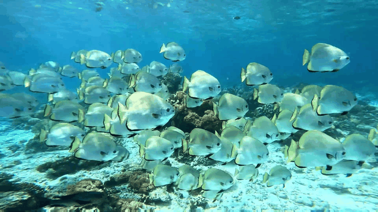
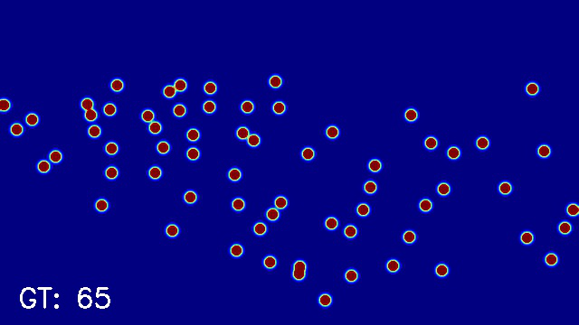
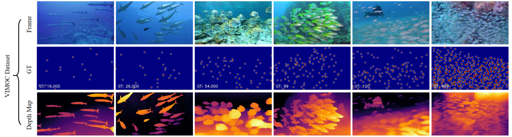
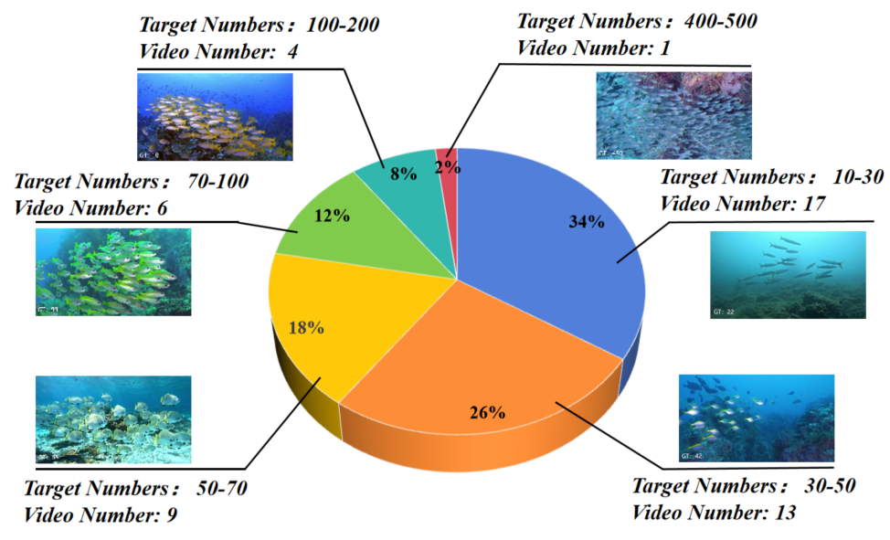
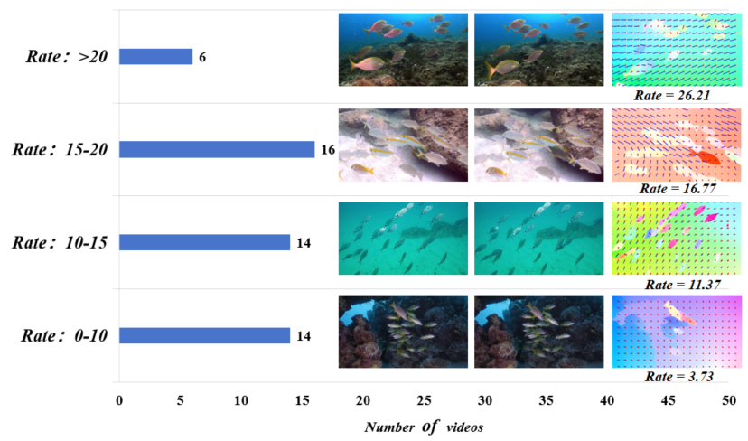

# VIMOC-Net
Depth-Assisted Network for Indiscernible Marine Object Counting with Adaptive Motion-Differentiated Feature Encoding

<div>
  
  
  
</div>

## Setup
Pytorch 1.10.2

Python 3.8.19

Optical flow estimates for this project are based on RAFT, which you can find [here](https://drive.google.com/drive/folders/1sWDsfuZ3Up38EUQt7-JDTT1HcGHuJgvT)

## Dataset preparation 
The dataset comprises 50 high-definition fish videos, with each 10th frame annotated, resulting in approximately 40, 800 annotated points in total.

<div>
  
</div>

<div>
  

</div>

You need to prepare datasets for following training and testing activities. [Datasets](https://drive.google.com/file/d/12vmbS7p7gIDv2-T-pJUgGJRPLi5lvh_E/view?usp=sharing)


## Pre-train models
You can download the model weights we provided [here](https://drive.google.com/file/d/1H8N6d3ugaGdzsQ1rF0Dmd-1wzgzGuVzT/view?usp=drive_link)

## Test

We recommend putting **raft-things.pth** in the *./RAFT* folder and **model_best.pth.tar** in the main folder. You can test VIMOC-Net with:

```shell
python test.py --raft_model /path/to/RAFT/raft-things
```

## Train

The training code will be available after the paper is received!
